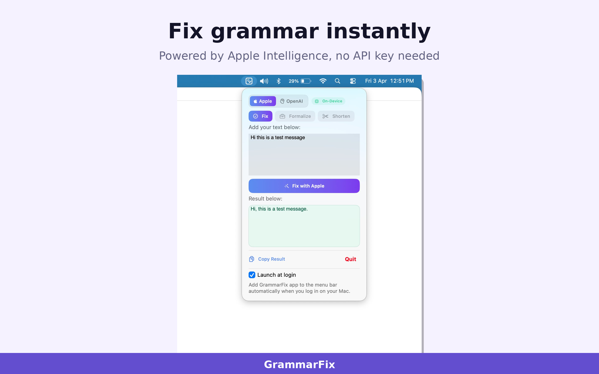
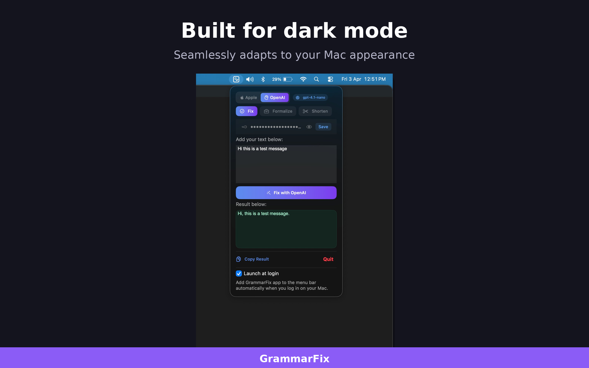
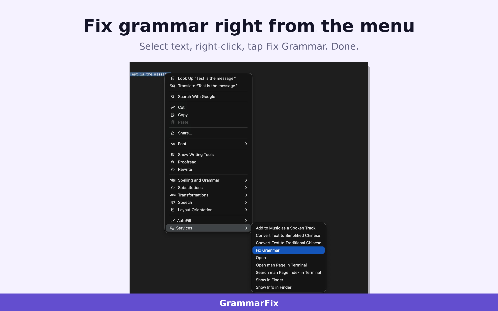

# GrammarFixAI

  

A lightweight, menu bar–based macOS grammar checker that lets you instantly correct grammar, spelling, and punctuation from anywhere in your workflow — no sign-up required, totally free.

---

## 📥 Installation

Download from the **[Mac App Store](https://apps.apple.com/us/app/grammarfixai/id6751153698?mt=12)**.

---

## 📖 Important Note

I’m sharing this source so others can **explore, learn from it, and hopefully gain useful insights**.

Please note, however, this is **not** intended for rebranding or redistribution under a different name with minimal changes.

---
 
## Screenshots
 
| | |
|---|---|
|  |  |
| Fix with Apple Intelligence | Fix with OpenAI |
|  |  |
| Dark mode support | Fix Grammar from the Services menu in any app |
 
---

### 🔧 Configuration Steps

1. Download the project
3. Update the app identifier for the project
4. Also update the `keychain-access-groups` in the `GrammarFixAI.entitlements`
5. Now run the project

---

## 🚀 Usage

1. Launch GrammarFixAI — it lives in your menu bar.
2. Paste or type text, then click **Fix** for instant corrections.
3. Use ⌥⌘0 or Services menu to correct selected text in any app.
4. Enable _Launch at Login_ in preferences if you want it always running.

---

## 🖥 Requirements

- macOS **26.0 or later**
- App size: ~2 MB
- Language support: English
- Price: Free

---

## 📜 License

This project is licensed under a custom BSD-style license. See the [LICENSE](LICENSE) file for details.
